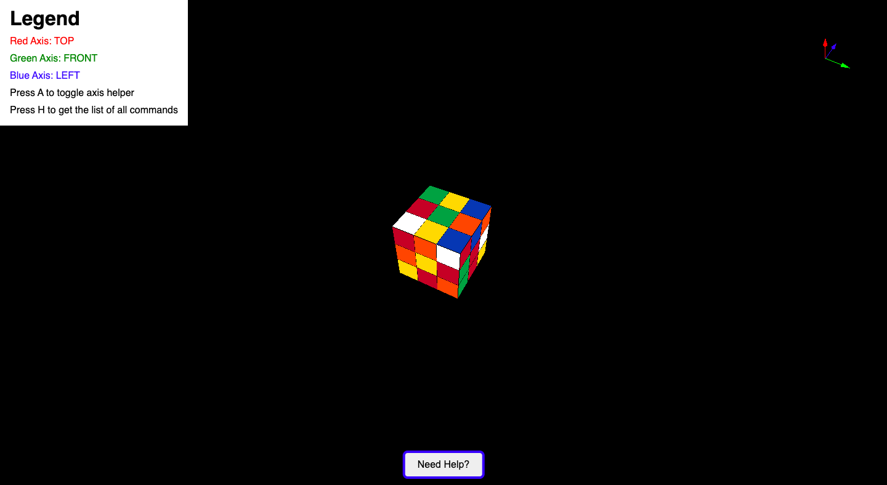

# Rubik's Cube Simulation

This is a simulation of a 3x3 Rubik's Cube in the browser made using Three.js.





# Installation and Running the project

After cloning the project, run the following commands in the terminal in the project folder:

```
$ npm install
$ npx vite
```

Following output would be shown in terminal:


Now, go to the shown link (http://localhost:5173/ if image is not shown) in the browser of your choice.

Enjoy!

# How to play

In the center of the screen, a Rubik's Cube will be shown.

In order to make moves, first learn the Rubik's Cube notation: https://jperm.net/3x3/moves

Types of moves you will be able to make in this application:
1. Layer moves
2. Slice moves
3. Cube rotations

The layers:
- U: top layer
- F: front layer
- R: right layer
- D: bottom layer
- B: back layer
- L: left layer

In order to turn a layer clockwise, type the lowercase letter, but to turn a layer counter clockwise, type uppercase letter. E.g. 'u' will turn the upper layer clockwise, 'U' will turn the upper layer counter clockwise.

Slice moves:
- M: layer between L and R
- E: layer between U and D
- S: layer between F and B

Cube rotations:
- x: rotates the cube along x axis
- y: rotates the cube along y axis
- z: rotates the cube along z axis

## Helpers

Press A to show the current axes.
Press H to show help.